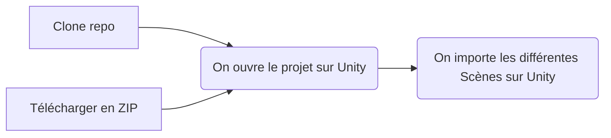

# The Epitechists: Escape from Epi!

Ce projet de fin d'année est un petit jeu réalisé sur Unity en 2D. Le but étant de collecter assez de pièces pour pouvoir s'échapper d'Epitech, en les trouvant par exemple ou encore en résolvant des mini-jeux / épreuves diverses... sous la contrainte du temps! 

# Stack technique

 - Unity 2021
 - C# ( avec Visual Studio )
 - Github pour le versionnage de fichiers
 - Github actions pour une petite touche de DevOps
 - GameCI, un repo github actions pour tester en quelques lignes l'intégralité du jeu
 - Piskel pour les magnifiques sprites

## Prérequis

Le jeu est encore en cours de développement (une release en .exe est prévue d'ici fin août ), mais si vous voulez avoir un aperçu de l'aspect technique suivez le tuto: 
### Installation de Unity

Direction le [Unity Store](https://store.unity.com/fr#plans-individual) pour choisir la license de Unity ( étudiant ou personnel) : les deux sont gratuites et suffisent amplement pour le projet.

On télécharge le setup; et on lance l'installation! La première partie est terminée!

### Installation de Visual Studio
Nous avons choisi de coder via Visual Studio pour des raisons pratiques, cependant, n'importe quel éditeur de code pouvant gérer du C# fera amplement l'affaire. Cette partie est donc optionnelle pour les personnes utilisant leur propre éditeur de code.
Direction le site de[ Visual Studio](https://visualstudio.microsoft.com/fr/free-developer-offers/) pour télécharger Visual Studio. On choisit la version appropriée selon notre système d'exploitation. Ici on part sur la version Community

Comme pour unity, on télécharge le setup et on lance l'installation!

## Setup

On clone le repo (tutoriel disponible [ici](https://www.journaldunet.fr/web-tech/developpement/1202921-comment-cloner-un-repository-git-dans-un-repertoire-specifique-de-mon-serveur-web/)) ou on le télécharge en ZIP pour les novice.

Une fois cette étape réalisée, il faut ouvrir le projet avec Unity:
Suite de la doc sur Windows.

En résumé:

## Lancer une scène

Cette étape sera non nécessaire lors de la release du .exe

